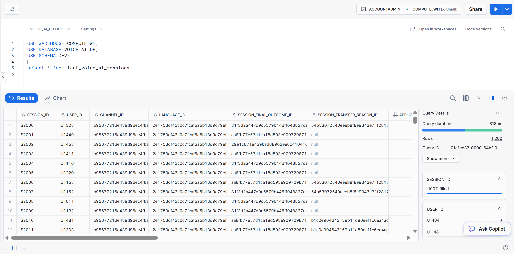
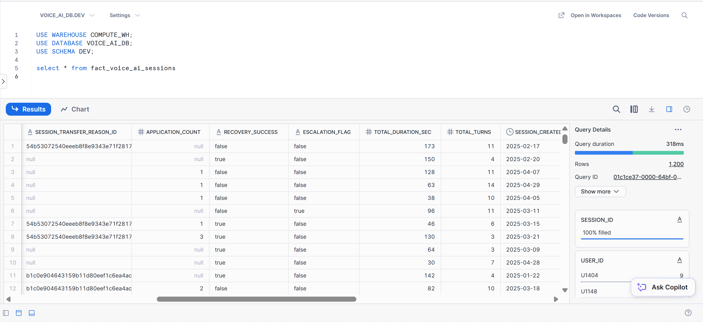
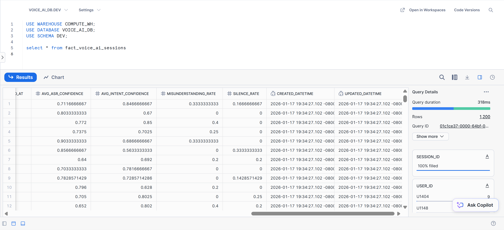
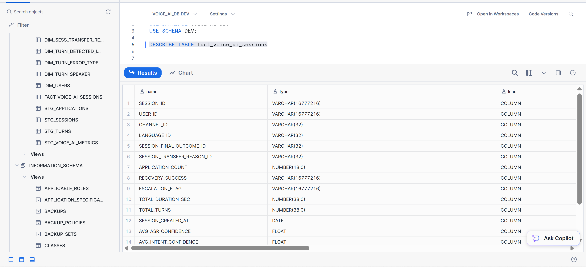

# Voice AI Data Modeling

## Overview

This project implements a data model with dbt for Voice AI session data, designed to support reliable KPI reporting, performance analysis, and downstream BI consumption.

---

## Prerequisites

Before starting, ensure the following are installed on your local machine:

* **Python** ≥ 3.10
* **Git**
* **Poetry** (recommended) or **pip**

> **Note:**
> This project uses **Poetry** for dependency and virtual environment management.
> `pip` can be used as an alternative, but commands will need to be adapted accordingly.

---

## 1. Clone the Repository

```bash
git clone <repo-url>
cd voice_ai_analytics
```

---

## 2. Environment Setup (Poetry)

### Initialize and install dependencies

```bash
poetry init
poetry install
```

This will:

* Create an isolated virtual environment
* Install all dependencies defined in `pyproject.toml`

Poetry automatically manages the virtual environment once any `poetry` command is executed.

---

## 3. dbt Dependencies (Core Packages)

To run dbt locally, the following core packages are required:

* **dbt-core**
  Core dbt framework for local development and execution.

* **dbt-snowflake**
  Adapter required to connect dbt to Snowflake.

> **Warehouse adapters**
>
> If you are using a warehouse other than Snowflake (e.g., BigQuery, Redshift, Databricks), replace `dbt-snowflake` with the appropriate dbt adapter.

All required dbt dependencies are already defined in `pyproject.toml`.

---

## 4. Initialize the dbt Project

Create the dbt project inside the repository:

```bash
poetry run dbt init dbt_model_voice_ai
cd dbt_model_voice_ai
```

During initialization, dbt will prompt for:

* Target warehouse
* Project name
* Profiles directory

These defaults can be modified later if needed.

---

## 5. Load Raw Data into the Warehouse

This project assumes **raw data already exists in the warehouse**.

### Reference implementation

* Warehouse: **Snowflake**
* Storage: **Amazon S3**
* Ingestion pattern: **External stage + COPY INTO**

> **Important:**
> dbt does not handle raw ingestion. This project starts at the **transformation layer**, assuming raw data is available.

You may use any ingestion approach (custom pipelines to load to a preferred data warehouse), as long as raw tables are accessible in the warehouse.

---

## 6. Configure Warehouse Credentials

Create a `.env` file in the project root and add your Snowflake credentials:

```env
VOICE_AI_SNOWFLAKE_ACCOUNT=XXXXX
VOICE_AI_SNOWFLAKE_USER=XXXXX
VOICE_AI_SNOWFLAKE_PASSWORD=XXXXX
VOICE_AI_SNOWFLAKE_WAREHOUSE=XXXXX
VOICE_AI_SNOWFLAKE_DATABASE=XXXXX
VOICE_AI_SNOWFLAKE_SCHEMA=XXXXX
VOICE_AI_SNOWFLAKE_ROLE=XXXXX
```

---

## 7. Validate dbt Configuration

Run the following command to verify connectivity and configuration:

```bash
poetry run dbt debug
```

This validates:

* Warehouse connection
* Profile configuration
* Adapter installation
* Permissions

---

## 8. Install dbt Packages

Install all dbt package dependencies (e.g., `dbt_utils`):

```bash
poetry run dbt deps
```

---

## 9. Execute dbt Models

### Run staging models

Staging models standardize and lightly transform the raw data.

```bash
poetry run dbt run -s staging
```

### Run marts (analytics-ready models)

Marts contain finalized **fact** and **dimension** tables designed for BI and analytics.

```bash
poetry run dbt run -s marts
```

---

## 10. Validate Results in the Warehouse

Once execution completes successfully, you can query the transformed models directly in Snowflake.

Primary analytics table:

* **`fact_voice_ai_session`**

Supporting dimension tables:

* Language
* User
* Session attributes
* Other analytical dimensions

Fact Voice Session model:

- **Screenshot of `fact_voice_ai_session` query results**

- 

- 

- 

- **Data dictionary / schema overview for `fact_voice_ai_session`**

- 


These artifacts show:

* Correct grain
* Referential integrity
* Analytics-ready structure

---

## Project Assumptions & Design Notes

* dbt is used **exclusively for transformations**, not ingestion.
* Staging models apply **light, reversible transformations**.
* Business logic and analytics semantics live in **marts**.
* Incremental materializations are used where appropriate to optimize cost and performance.
* The project follows a **layered dbt architecture** aligned with production best practices.
